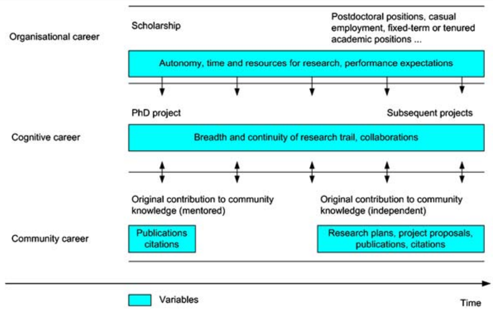
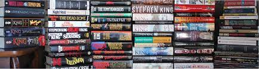

# Introducción {#intro}

- La publicación científica es considerada el culmen del trabajo de investigación. No se considera que un trabajo de investigación está finalizado hasta que éste no se ha hecho público.

>Research is complete only when the results are shared with the scientific community. Although such sharing is accomplished in various ways, both formal and informal, the traditional medium for communicating research results is the scientific journal.
<div style="text-align: right"> _Publication Manual of the American Psychological Association, 6th edition_  </div>

<br>

- La revista científica se considera el principal vehículo de comunicación científica por su velocidad de difusión. Algo que lleva cuestionándose varias décadas desde que la comunicación científica pasó al formato digital. Esta evolución ha tenido lugar en paralelo al desarrollo del llamado **método científico**.
<br>
```{r, echo=FALSE, out.width="100%", fig.cap="Evolution of the scholarly communication system"}
knitr::include_graphics('images/cronograma-scicomm.png')
```

Según el _Oxford English Dictionary_, el método científico es:

>A method or procedure that has characterized naturla sciences since the 17th Century, consisting in **systematic observation, measurement**, and **experiment**, and the **formulation, testing**, and **modification of hypotheses**.

Y conlleva las siguientes tareas:

1. Definir la pregunta de investigación
2. Recoger información
3. Formular la hipótesis
4. Testar la hipótesis
5. Analizar los datos
6. Interpretar los resultados
5. Publicar los resultados **a través del medio adecuado**.

**Recursos recomendados**

- [Publication in scientific journals. Impact factors](https://www.slideshare.net/figaro/publication-in-scientific-journals-impact-factors)

- [Historia del Acceso Abierto](https://docs.google.com/presentation/d/1SlwGRwuQ2EntxCzirPH613KZNwHxm9A6MoKalH0I2mU/edit?usp=sharing)

## Las tres carreras académicas

Los sociólogos de la ciencia alemanes [Grit Laudel y Jochen Gläser](https://link.springer.com/content/pdf/10.1007/s10734-007-9063-7.pdf) describen la carrera académica como un proceso que tiene tres niveles:

- **Nivel organizacional**. Es la carrera profesional, es decir, nuestro avance dentro de la institución desde becario a catedrático. Esto supone enfrentarse a los diversos procesos evaluativos de contratos, promoción, acceso a plazas, etc.
- **Nivel científico**. Supone todo lo relativo a los logros científicos y contribuciones al campo hechas por el investigador.
- **Nivel comunitario**. Tiene que ver con el prestigio y capital social que vamos adquiriendo conforme avanzamos en nuestra carrera académica. En otras palabras, se refiere a nuestra _reputación_ como investigadores y puede ser clave para tener acceso a información e infrastructuras - [Colegios invisibles](https://www.amazon.com/Invisible-Colleges-Diffusion-Scientific-Communities/dp/0226118576).

En un mundo ideal, para avanzar en uno de estos niveles, es necesario que los otros dos estén alineados.

<center>{width=75%}</center>

## El científico como escritor obrero

{width=100%}

Stephen King habla del escrito _best-seller_ como un escritor obrero, al que nadie considera por sus cualidades literarias pero para el que el estilo es esencial si quiere atrapar al lector en sus textos.

El investigador debe aspirar al mismo tipo de escritura. No se trata de mostrar nuestras cualidades artísticas como escritores, sino de persuadir y atrapar al lector.

**Las lecciones de Stephen King**:

- Sé resiliente al rechazo, [todos lo somos](https://onlinelibrary.wiley.com/doi/10.1002/asi.22794)
- Aprende del rechazo y tómatelo con deportividad
- Sé crítico con tu trabajo y ambicioso. Enfréntate a la [cultura de la productividad](https://www.newyorker.com/culture/office-space/the-frustration-with-productivity-culture?utm_source=pocket_mylist) mal entendida.
- Escribe para tí, revisa y edita para los demás.

>when you write a story, you're telling yourself the story [...] When you rewrite, your main job is taking out all the things that are not the story
<div style="text-align: right"> Stephen King, _On Writing_  </div>

