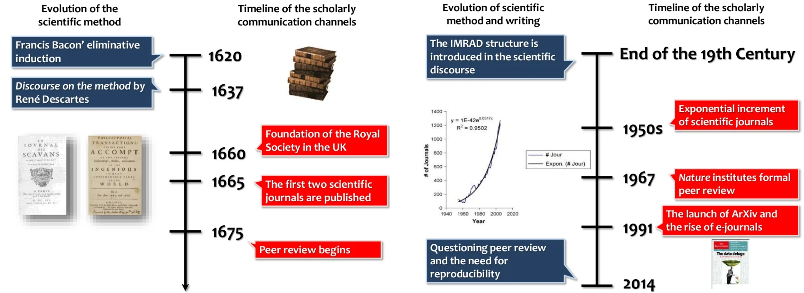

# Introducción {#intro}

La publicación científica es considerada el culmen del trabajo de investigación. No se considera que un trabajo de investigación está finalizado hasta que éste no se ha hecho público.

>Research is complete only when the results are shared with the scientific community. Although such sharing is accomplished in various ways, both formal and informal, the traditional medium for communicating research results is the scientific journal.
<div style="text-align: right"> _Publication Manual of the American Psychological Association, 6th edition_  </div>

La revista científica se considera el principal vehículo de comunicación científica por su velocidad de difusión. Algo que lleva cuestionándose varias décadas desde que la comunicación científica pasó al formato digital. Esta evolución ha tenido lugar en paralelo al desarrollo del llamado **método científico**.

```{r, echo=FALSE, out.width="100%", fig.cap="Evolution of the scholarly communication system"}

```

Según el _Oxford English Dictionary_, el método científico es:

>A method or procedure that has characterized naturla sciences since the 17th Century, consisting in **systematic observation, measurement**, and **experiment**, and the **formulation, testing**, and **modification of hypotheses**.

Y conlleva las siguientes tareas:

1. Definir la pregunta de investigación
2. Recoger información
3. Formular la hipótesis
4. Testar la hipótesis
5. Analizar los datos
6. Interpretar los resultados
5. Publicar los resultados **a través del medio adecuado**.
Filosofía general: ¿por qué escribir bien y por qué publicar?
- El objetivo de la investigación
- Mini recorrido histórico del sistema de publicación científica

**Recursos recomendados**

- (Publication in scientific journals. Impact factors)[https://www.slideshare.net/figaro/publication-in-scientific-journals-impact-factors]

- (Historia del Acceso Abierto)[https://docs.google.com/presentation/d/1SlwGRwuQ2EntxCzirPH613KZNwHxm9A6MoKalH0I2mU/edit?usp=sharing]

## Las fases de la carrera académica

Los sociólogos- Las tres comunidades de Gläser y Laudel

## El científico como escritor obrero
Las lecciones de Stephen King:
- Nadie te considerará para un Nobel de literatura, pero serás el más leído

## Resistencia al rechazo
> 'this is good. Not for us, but good. You have talent. Submit again'

- Aprende del rechazo y tómatelo con deportividad
- Conócete a tí mismo y encuentra tu voz


## Escribe para tí, revisa para los demás

>when you write a story, you're telling yourself the story [...] When you rewrite, your main job is taking out all the things that are not the story

