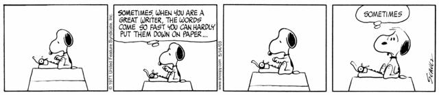

# La elección del tema de investigación

{width=100%}

## Anatomía de una idea

La creatividad es esencial para tener una carrera académica exitosa.

Es importante tener muy claro que las ideas no son de nadie hasta que no son publicadas, de ahí muchas veces las disputas por [la prioridad científica](https://doi.org/10.2307/2089193).

Las ideas cientificas se caracterizan por ser:

- **Originales**. En mi experiencia muchas de las mejores ideas suelen ser recombinaciones de ideas previas.
- **Inéditas**. Toda publicación científica debe ser original en el sentido de que se considera práctica no ética la publicación duplicada y puede llevar a retractaciones y acusaciones de fraude.
- **Novedosas**. El trabajo debe tratar un tema no tratado anteriormente o hacerlo empleando técnicas novedosas que puedan aportar nuevo conocimiento a la disciplina y abordar una cuestión desconocida hasta el momento.

Luego está el tema de su utilidad...

{width=75%}

## Herramientas de búsqueda bibliográfica

¿Cómo podemos tener ideas? La procrastinación suele ser enemigo de la productividad. Pero a veces da lugar a procesos de serendipia ([Yaqub, 2018](https://www.sciencedirect.com/science/article/pii/S0048733317301774)).

Podemos identificar cuatro tipos de **serendipia**:

1. Buscar una cosa y encontrar otra
2. Buscar una solución de una manera inesperada
3. Investigación básica que resuelve un problema inmediato
4. Investigación básicoa que añosdespués resulta crucial para resolver un problema.

Las dos últimas son por las que aboga [Flexner en su ensayo](https://www.ias.edu/sites/default/files/library/UsefulnessHarpers.pdf).

Si no sabes cómo empezar a buscar información para elegir el tema de investigación, ten en cuenta que **la bibliometría puede ser tu amiga**. 

Todo esto se puede refinar aún más haciendo uso de herramientas de visualización fáciles de usar como son las siguientes:

- [Bibliometrix](http://www.bibliometrix.org/) – [Paper](http://doi.org/10.1016/j.joi.2017.08.007) – [Videotutoriales de Dani](https://bibliometriaobarbarie.com/bibliometria-now/) – [Curso en YSP](https://youtu.be/nGalqId6vG4)
- [Vosviewer](https://www.vosviewer.com/) - [Paper](http://dx.doi.org/10.1007/s11192-009-0146-3) - [Curso en YSP](https://yosigopublicando.ugr.es/courses/mapeando-la-ciencia-con-vosviewer/)

Otra estrategia para mantenerte al día es utilizar las alertas de [Google Scholar Profiles](http://scholar.google.com/)

## Práctica de clase {-}

Realicemos la siguiente práctica:

1. Vamos a hacer una búsqueda sobre un tema en la Web of Science.
2. Utilizaremos las opciones de filtrado para delimitar por trabajos de alto impacto
3. Utilizando las opciones de temática o de tipo de documento podemos refinar más.
4. Utilizando la opción _Analyze_ podemos obtener una panorámica rápida sobre los autores que trabajan sobre el tema, las revistas que más publican o los países más productivos.
