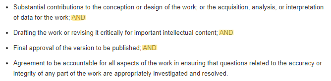
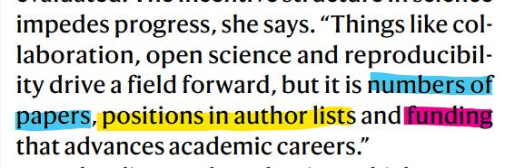

# La autoría científica

- La autoría científica sigue siendo hoy día el mayor crédito que recibe un académico por su trabajo. 
- No sólo es importante para el investigador ser autor de los trabajos en los que participa, sino también la posición de firma que ocupa.

## ¿Qué es un autor?

{width=100%}
 
**The [ICMJE](http://www.icmje.org/recommendations/browse/roles-and-responsibilities/defining-the-role-of-authors-and-contributors.html) recommends...**

{width=100%}

Pero en un mundo donde cobran cada vez más importancia y relevancia los trabajos colaborativos para avanzar el progreso científico, esto puede ser muy problemático.

{width=75%}

[Fleming, (2021). The authorship rows that sour scientific collaborations. Nature 594, 459-462](https://doi.org/10.1038/d41586-021-01574-y)

 

Normalmente se considerarán las siguientes posiciones por orden de importancia: **primer autor**, **último autor**, **autores intermedios**. Normalmente la posición de último autor suele ir reservada al supervisor.

### Recomendaciones para evitar disputas de autoría {-}

1. Acuerda desde el primer momento cómo se distribuirá la carga de trabajo y la autoría
    - Si la carga de trabajo cambia durante el estudio, **acláralo**, ya que debería reflejar también cambios en la autoría.
2. Intenta evitar en la manera de lo posible la inclusión de _demasiados_ autores.
3. Sé honesto contigo mismo.
4. Sé riguroso pero flexible.
    - Por ejemplo, cuando se den colaboraciones entre distintos equipos
5. Si es la primera vez que colaboras con ellos, mira cómo firman sus papers anteriores.
6. Habla las cosas directamente, aunque a veces resulte desagradable.
7. Mantén la calma y evita ambientes tóxicos.
8. Registra tu trabajo para que haya constancia del mismo.
9. Evita la inclusión de autores fantasma (en la medida de lo posible).
10. Sé agradecido con quienes contribuyeron pero no son autores.

## Las contribuciones

- Desde hace años se lleva proponiendo un cambio de paradigma para huir del concepto de autoría hacia el de las contribuciones.
- Muchas revistas incluyen además de los autores, la distribución de tareas de los mismos. [Un ejemplo](https://doi.org/10.7554/eLife.60586)
- Una de las propuestas más firmes que hay en la actualidad es la [**taxonomía CReDIT**](https://credit.niso.org/).
- Los tipos de contribuciones que hacen los investigadores nos permiten identificar los roles que estos adoptan... y hay malas noticias...
  - **El tipo de contribuciones determina tu futuro en la academia**.
  - Existen **efectos estructurales que empujan a las mujeres en las primeras etapas de su carrera a adoptar roles que perjudican su éxito académico**.
