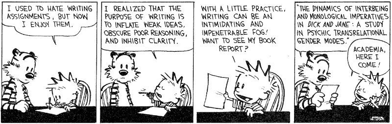

# Cuestiones de estilo

{width=100%}

## La historia

A pesar de la rigidez que impone la estructura IMRyD en un artículo científico, es esencial plantearse la escritura de un paper como [la narración de un relato](https://patthomson.net/2021/02/01/writing-for-publication-finding-an-angle-and-an-argument/).

Una buena historia debe de ser directa, fluida y concisa. Los estudios científicos son ya lo suficientemente complejos como para que a eso sumemos una lectura oscura y difícil.

**¡Muy importante!**

1. **Conoce a tu público**. Tienes dos tipos de lectores a los que convencer con diferentes niveles de exigencia:
    - _El revisor_. Serán probablemente las personas que más tiempo le dediquen a la lectura de tu trabajo. Tu labor es convencerles sobre cuatro aspectos fundamentales de tu trabajo:
      - Es un trabajo original y novedoso.
      - La metodología es adecuada, la recogida de datos y análisis son rigurosos y serios.
      - Los resultados están bien interpretados y se han considerado todas las posibles limitaciones del trabajo, tanto para minimizarlas como para reportar aquellas que no han podido ser solventadas.
      - Está bien escrito y presentado.
    - _La comunidad académica_. Aquí los retos que debemos de superar son diferentes, ya que debemos captar su atención y mostrar la pertinencia y relevancia de nuestro trabajo.
      - Visibilidad del trabajo. ¿Utilizamos los términos adecuados y lo difundimos de la manera adecuada para que sea fácilmente recuperable? (Más sobre esto el jueves y en la preparación del manuscrito)
      - Claridad en la presentación. ¿Se identifica rápidamente el valor del trabajo? ¿Está escrito de manera clara y eficaz? [Ejemplo malo](https://link.springer.com/content/pdf/10.1007/s11192-013-1000-1.pdf) – [Ejemplo bueno](https://journals.plos.org/plosone/article?id=10.1371/journal.pone.0183551).
      - Medio adecuado. ¿Estoy seleccionando la mejor vía para llegar a mi público? 
2. **Crea una hoja de ruta** lo más detallada posible imaginando cómo será tu trabajo:
Un párrafo, una idea. Un párrafo entre 150 y 200 palabras
3. Ten claro **el hilo conductor** que une cada párrafo
4. Piensa desde un primer momento en **las figuras y tablas** que quieres mostrar, ¿cómo serían? ¿cuántas? ¿dónde aparecerían?

## Estilo y citación

### ¿Cuándo y qué citar? {-}
- Las citas en el artículo científico tienen una triple misión: demostrar al evaluador tu dominio del campo, reflejar los trabajos que han influido en tu estudio y apoyar tus argumentaciones.
- Ve siempre a la cita original.
- Si se trata de algo específico o una cita literal, señala la página donde se encuentra.
- Ten en cuenta que la ciencia progresa y es habitual encontrar trabajos con resultados contradictorios. [Scite.ai](https://scite.ai)
- Argumenta siempre con evidencias empíricas y no te apoyes en afirmaciones espúreas o resultados cuestionables.

### ¿Cómo citar? {-}

1. No hagas nada a mano **please!**
2. Sé honesto, cita lo que lees y no omitas información
3. Es lógica la autocita, pero con moderación.
4. Es lógico citar artículos de la revista a la que envías el manuscrito.
5. Es normal que un revisor recomiende citas, pero no las debe imponer.
6. No es normal que sea el editor de la revista quien recomiende las citas.

Algunos materiales recomendados:

- [Presentación sobre el uso de las referencias bibliográficas y el manejo de Zotero](https://docs.google.com/presentation/d/1JTvMhoIQoT6Vapb_djWslf5WfTRyRKejKV0te1bKj3A/edit?usp=sharing)
-  [Informe APEI sobre redacción científica de Baiget y Torres-Salinas (2013)]
- [Writing without bullshit](https://www.amazon.com/Writing-Without-Bullshit-Career-Saying/dp/0062477153)

## Decálogo de buenas prácticas

1. **Comienza de manera directa clara y concisa**.
2. **Evita la forma pasiva**, mejor primera persona del plural o singular.
3. **El artículo científico es un documento cíclico**. Se presenta un problema en la _introducción_, se expande una posible solución (_métodos_) y se presentan los _resultados_. Luego se revisa el problema inicial, se _discute_ hasta qué punto los resultados responden y se _concluye_ con una reflexión sobre las implicaciones y cómo continuar avanzando en el futuro.
4. **Estructura tu trabajo**. No sólo tiene que tener una estructura clara pero también visualmente atractiva. Evita párrafos de una línea o de una página.
5. **Cuida las figuras**. Utilízalas con sabiduría y dedica tiempo a la edición de las mismas.
6. **Busca la inspiración en el trabajo de otros**. Cuando leas otros trabajos, no sólo te fijes en el contenido, analiza el estilo, la presentación de resultados.
7. **Ten clara la historia que estás contando**. Piensa en la(s) idea(s) con las que debe quedarse el lector una vez acabe de leer tu trabajo. Una, dos, no más.
8. **Simplifica**. Evita la retórica y los ejercicios estilísticos.
9. **Házle caso a Stephen King**. Escribe para tí, revisa para los demás. 
10. **Revisa, revisa y revisa**. Es esencial que releas una y otra vez tu trabajo, intentando en cara relectura simplificar y eliminar conectores (e.g., therefore, however, in regard to).

## Práctica de clase {-}

1. Sigue las pautas marcadas y edita este breve párrafo:

>Science is at a crossroads. Scientists must push scientific progress, respond to societal demands, and engage with and outreach to society. Added these to job insecurity, and fierce competition, there is growing discomfort within academia on the way in which research is currently managed. However, scientists are also partially responsible for this situation. They are involved in evaluation panels and dictate criteria for career development.

2. Vamos a manejar Zotero y ver cómo aplicar las normas de citación de las revistas utilizando plantillas.
