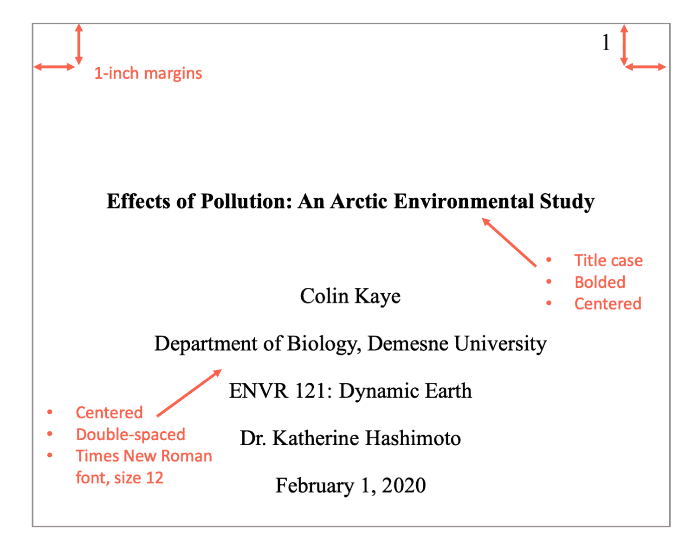

# Edición y preparación del manuscrito

## Los metadatos
{width=75%}

La portada de un trabajo deberá incluir la siguiente información:

- Título
- Autores
- Afiliación
- Resumen
- Palabras Clave

## Título, resumen y palabras clave

Estos tres campos son esenciales para visibilizar un trabajo científico. Aquí hay que tener en cuenta las siguientes variables:

- Sintético y al grano
- Atractivo y sexy. Que llame la atención del lector (lo más cercano a un clickbait pero de manera ética y honesta)
- Con los conceptos esenciales para que pueda ser recuperado por los lectores

Tipos de títulos:

- **Informativo**. Ejemplo: _Map of synthetic rescue interactions for the Fanconi anemia DNA repair pathway identifies USP48_
- **Explicativo**. Ejemplo: _Planning a title: Practices and preferences for titles with colons in academic articles_
- **Atractivo**. Ejemplo: _The unbearable emptiness of tweeting – About journal articles_
- **Intrigante**. Ejemplo: _What is an emerging technology?_

**Tips**:

- Prueba a hacer búsquedas en Google Scholar para identificar términos relevantes que deban aparecer en tu trabajo.
- Invierte tiempo en escribir un buen abstract que sintetice y refleje la estructura del paper. Seguramente será lo único que la mayoría de la gente lea.

## Formatos de revista y plantillas

Aunque no siempre es posible, es importante tener clara relativamente pronto la revista a la que se enviará el documento, o al menos la comunidad académica, ya que esto servirá para guiarnos sobre el tono, el estilo de escritura y el formato de la revista.

Algunos ejemplos de formatos según la revista:

- [PNAS](https://www.pnas.org/)
- [Plos One](https://journals.plos.org/plosone/)
- [The New England Journal of Medicine](https://www.nejm.org/)
- [Research Policy](https://www.journals.elsevier.com/research-policy/)

Algunas revistas cuentan con plantillas para que puedas enviar el artículo maquetado, aunque esto no suele ser lo habitual ni tampoco imprescindible:

- Latex – [Overleaf](https://www.overleaf.com/)
- Rmarkdown – [Rticles](https://github.com/rstudio/rticles)
