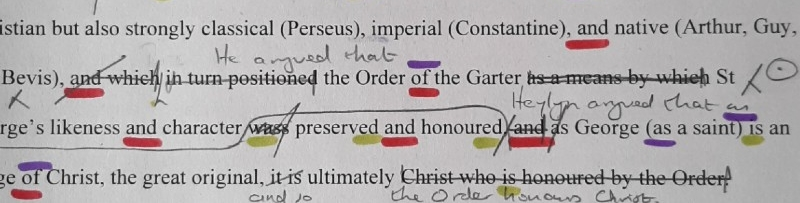

--- 
title: "Cómo redactar un artículo científico en Ciencias Sociales"
author: "Nicolás Robinson-Garcia"
date: "`r Sys.Date()`"
knit: 'bookdown::render_book'
site: bookdown::bookdown_site
output: bookdown::gitbook
documentclass: book
bibliography: [book.bib]
biblio-style: apalike
link-citations: yes
github-repo: rstudio/escritura-academica
description: "Materiales de la charla sobre escritura académica. Curso de la Escuela de Doctorado de Ciencias Sociales de la UGR."
url: 'https://elrobin.github.io/escritura-academica'
---

# Bienvenido/a {-}

{width=100%}

**Curso:** Cómo escribir y publicar artículos científicos en Ciencias Sociales y Humanidades.

**Organiza:** Escuela Internacional de Posgrado de la Universidad de Granada

**Imparten:** [Evaristo Jiménez-Contreras](https://www.ugr.es/en/staff/evaristo-jimenez-contreras), [Daniel Torres-Salinas](https://sites.google.com/go.ugr.es/torressalinas) y [Nicolás Robinson-García](https://nrobinsongarcia.com)

Esta página contiene el material impartido por Nicolás Robinson-García para la sesión sobre redacción científica. En esta sesión trataremos diferentes cuestiones prácticas sobre la preparación del manuscrito académico, edición y estilo.

Ten en cuenta que este es un documento vivo, por lo que irá incorporando nuevos materiales con el paso del tiempo y puede que haya partes que estén aún incompletas.

